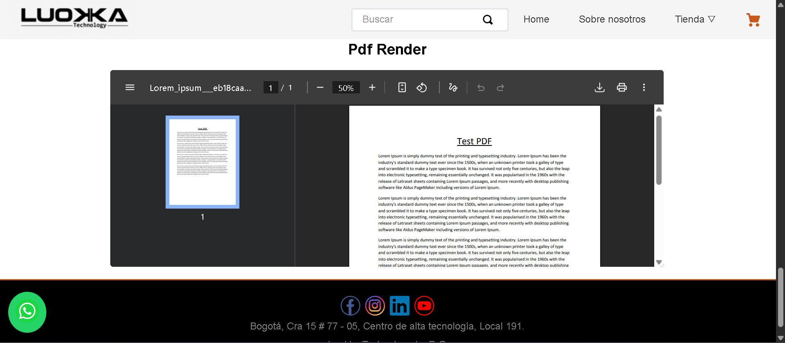

# 📄 Componente Pdf Reader 

> Será un lector para Pdfs

* [🚀 Visión General](#-visión-general)
* [🖼️ Previsualización del Componente](#-previsualización-del-componente)
* [🏗️ Instalación y Ejemplo de Uso](#-instalacion-y-ejemplo-de-uso)
    * [1. Dependencia](#1-dependencia)
    * [2. Declaración en Blocks](#2-declaración-en-blocks)
* [⚙️ Propiedades (Props)](#-propiedades-props)
* [🎨 Personalización con CSS Handles](#-personalización-con-css-handles)
* [🪪 Contribución y Licencia](#-contribución-y-licencia)


## 🚀 `Visión General`

Este componente fue creado con el template de `react-app-template` y su propósito es renderizar un archivo PDF directamente incrustado en una página de la tienda, utilizando la etiqueta nativa `<object>`. Esto permite mostrar documentos (como manuales, términos y condiciones o catálogos) sin forzar la descarga o la navegación a una nueva pestaña.

El componente también incluye un *fallback* (`<iframe>`) para asegurar la compatibilidad con navegadores que no soportan la incrustación directa del objeto. Además, utiliza el *hook* `useState` y `useEffect` para asegurarse de que el componente esté montado antes de renderizar el PDF.


## 🖼️ `Previsualización del Componente`




## 🏗️ `Instalación y Ejemplo de Uso`

### 1. Dependencia

Asegúrate de que la aplicación del componente esté declarada como dependencia en el `manifest.json` de tu tienda.

```json
"dependencies": {
  "{vendor}.pdf-reader": "0.x"
}
```

### 2. Declaración en Blocks

El componente se declara como un bloque estándar en cualquier *template* o bloque principal:

```json
"pdf-reader": {
  "title": "PDF Reader",
  "props": {
    "url": "assets/documents/Lorem_ipsum.pdf",
    "width": 900,
    "height": 520
  }
}
```


## ⚙️ `Propiedades (Props)`

| Propiedad | Tipo | Obligatorio | Valor por Defecto | Descripción |
| :--- | :--- | :--- | :--- | :--- |
| **`url`** | String | Sí | N/A | URL o path del archivo PDF que se desea mostrar. |
| **`width`** | Number | Sí | `900` | Ancho del contenedor del PDF en pixeles. |
| **`height`** | Number | Sí | `520` | Altura del contenedor del PDF en pixeles. |
---


## 🎨 `Personalización con CSS Handles`
Puedes personalizar la apariencia de los elementos usando las siguientes clases (CSS Handles):

| Handle | Elemento | Descripción |
| :--- | :---| :--- |
| **`container__pdf`** | `<div>` | Contenedor principal que envuelve el `<object>` que renderiza el PDF. |
| **`title__pdf`** | `<h2>` | Título predeterminado del componente: **"Pdf Render"**. |
| **`object__pdf`** | `<object>` | El elemento HTML `<object>` que incrusta el archivo PDF. |


## 🪪 `Contribución y Licencia`

### 🤝 Contribución 

Si deseas contribuir con mejoras, reportar *bugs* o sugerir nuevas características:

1.  Haz un *fork* del repositorio.
2.  Crea una nueva rama (`git checkout -b feature/nueva-funcionalidad`).
3.  Realiza tus cambios y haz *commit* (`git commit -m 'feat: Añadir nueva funcionalidad'`).
4.  Sube la rama (`git push origin feature/nueva-funcionalidad`).
5.  Abre un *Pull Request*.

###  📜 Licencia

Este proyecto está bajo la **Licencia MIT**.

> **[](https://opensource.org/licenses/MIT)**

> **[](https://github.com/vtex-apps/whatsapp-button/blob/main/LICENSE)**